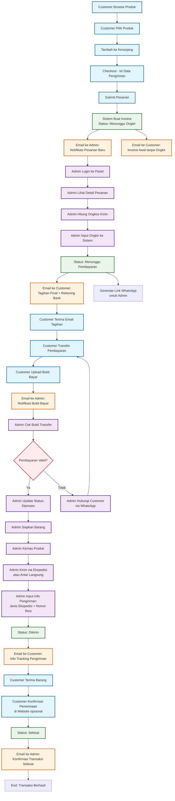
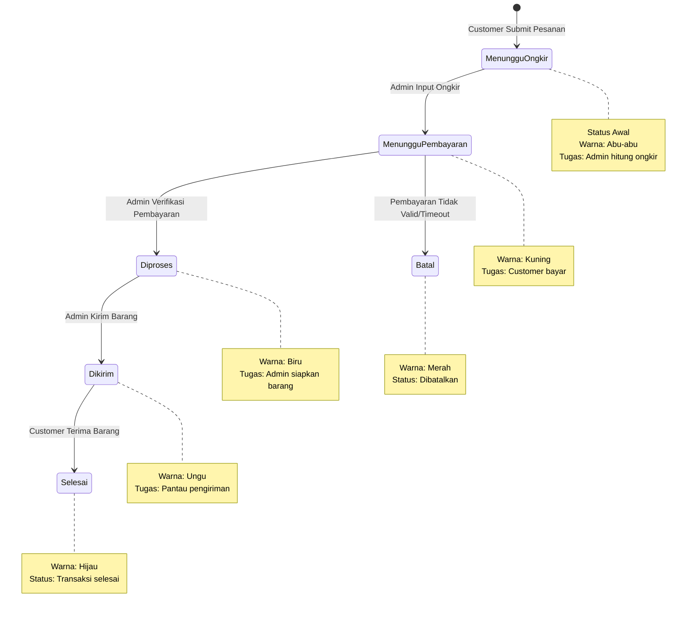
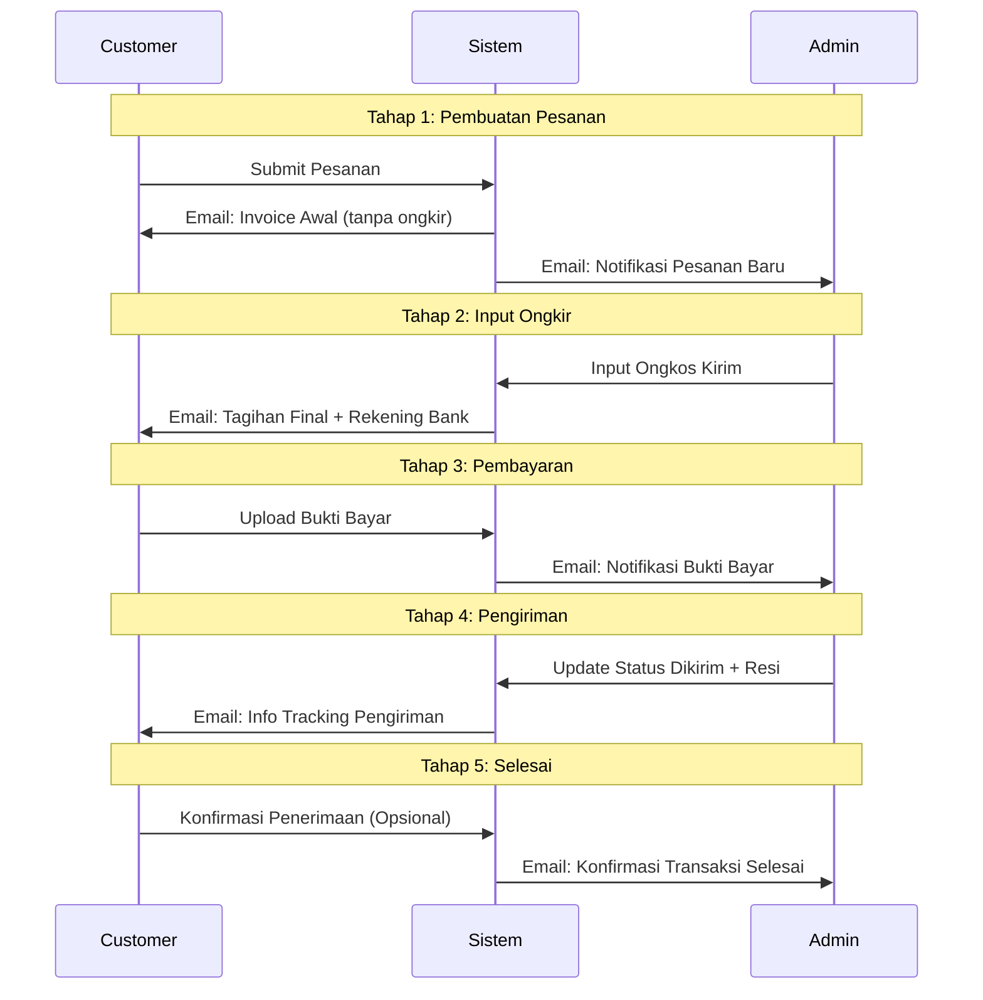
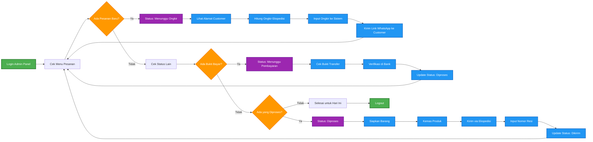

# Flowchart Kegiatan Transaksi BIZPART24

## Diagram Alur Transaksi Lengkap



## Penjelasan Status Pesanan



## Timeline Email Notifications



## Flowchart Tugas Admin per Status



## Checklist Harian Admin

```mermaid
flowchart TD
    A[Mulai Hari Kerja] --> B[Login Admin Panel]
    B --> C[Cek Email Notifikasi]
    C --> D[Buka Menu Pesanan]

    D --> E{Ada Status<br/>Menunggu Ongkir?}
    E -->|Ya| F[✓ Proses Input Ongkir]
    E -->|Tidak| G{Ada Bukti Bayar<br/>Baru?}

    F --> H[✓ Kirim Info ke Customer]
    H --> G

    G -->|Ya| I[✓ Verifikasi Pembayaran]
    G -->|Tidak| J{Ada Status<br/>Diproses?}

    I --> K[✓ Update Status]
    K --> J

    J -->|Ya| L[✓ Siapkan & Kirim Barang]
    J -->|Tidak| M{Ada Pertanyaan<br/>Customer?}

    L --> N[✓ Input Info Pengiriman]
    N --> M

    M -->|Ya| O[✓ Balas via WhatsApp]
    M -->|Tidak| P[✓ Selesai untuk Hari Ini]

    O --> P
    P --> Q[Logout Admin Panel]

    %% Styling
    classDef task fill:#4caf50,stroke:#2e7d32,stroke-width:2px,color:#fff
    classDef check fill:#ff9800,stroke:#ef6c00,stroke-width:2px,color:#fff
    classDef end fill:#f44336,stroke:#c62828,stroke-width:2px,color:#fff

    class F,H,I,K,L,N,O task
    class E,G,J,M check
    class A,Q end
```

## Keterangan Warna Status

| Status                  | Warna      | Keterangan               | Tugas Admin        |
| ----------------------- | ---------- | ------------------------ | ------------------ |
| **Menunggu Ongkir**     | 🔘 Abu-abu | Pesanan baru masuk       | Input ongkos kirim |
| **Menunggu Pembayaran** | 🟡 Kuning  | Ongkir sudah diinput     | Tunggu bukti bayar |
| **Diproses**            | 🔵 Biru    | Pembayaran terverifikasi | Siapkan barang     |
| **Dikirim**             | 🟣 Ungu    | Barang sudah dikirim     | Pantau pengiriman  |
| **Selesai**             | 🟢 Hijau   | Customer terima barang   | Arsip pesanan      |
| **Batal**               | 🔴 Merah   | Pesanan dibatalkan       | Tidak ada tindakan |

## Tips Efisiensi Workflow

### Prioritas Harian:

1. **Pagi**: Proses semua "Menunggu Ongkir"
2. **Siang**: Verifikasi "Menunggu Pembayaran"
3. **Sore**: Siapkan barang "Diproses"
4. **Malam**: Kirim barang dan update "Dikirim"

### Tools Pendukung:

- **Kalkulator Ongkir**: JNE, JNT, SiCepat
- **Template WhatsApp**: Pesan standar untuk customer
- **Checklist Harian**: Pastikan tidak ada yang terlewat
- **Backup Resi**: Simpan foto resi untuk dokumentasi

---

**© 2024 BIZPART24 - Flowchart Sistem Transaksi**
